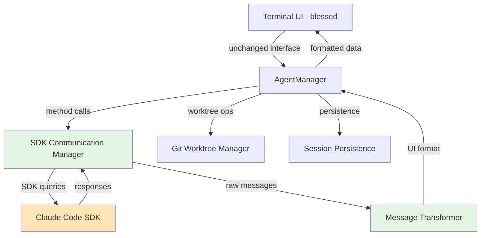

# Napoleon Brownfield Enhancement Architecture

## Introduction

This document outlines the architectural approach for enhancing ADD Manager with the Napoleon rebrand and Claude Code SDK integration. Its primary goal is to serve as the guiding architectural blueprint for the migration from CLI-based process management to SDK-based agent orchestration while ensuring seamless integration with the existing terminal UI system.

**Relationship to Existing Architecture:**
This document supplements the existing ADD Manager architecture by defining how the SDK integration will replace the current CLI process spawning mechanism. Where the existing system uses child process management, this document provides guidance on maintaining all current functionality while implementing a cleaner, more reliable SDK-based approach.

## Change Log

| Change | Date | Version | Description | Author |
|--------|------|---------|-------------|---------|
| Initial | 2025-01-17 | 1.0.0 | Created brownfield architecture for Napoleon transformation | Architect |

## Existing Project Analysis

### Current Project State

- **Primary Purpose:** Agent Driven Development Manager - A CLI tool for managing multiple Claude CLI sessions with isolated git worktrees
- **Current Tech Stack:** Node.js (16+), blessed (terminal UI), commander.js (CLI), winston (logging), git worktrees
- **Architecture Style:** Modular monolithic with clear separation between CLI, UI, Core logic, and utilities
- **Deployment Method:** NPM package with global CLI command (`add-manager`)

### Available Documentation

- Package.json with project metadata and dependencies
- Comprehensive inline code documentation
- Clear module separation with dedicated directories
- Well-structured error handling and logging system

### Identified Constraints

- Node.js 16.0.0+ requirement for modern JavaScript features
- Git 2.20.0+ required for worktree operations
- Claude CLI must be installed and accessible in PATH
- Maximum 3 concurrent agents (configurable)
- Process management complexity with stdin/stdout handling
- Limited ability to reattach to existing processes after restart

## Enhancement Scope and Integration Strategy

### Enhancement Overview

**Enhancement Type:** Core Communication Layer Replacement  
**Scope:** Replace CLI child process spawning with Claude Code SDK while maintaining all existing functionality  
**Integration Impact:** Medium - Core change but with minimal surface area impact

### Integration Approach

**Code Integration Strategy:** Surgical replacement of process management methods in AgentManager class
- Replace `spawnClaudeProcess()` with SDK initialization
- Adapt `sendInstructions()` to use SDK query methods
- Transform `handleAgentOutput()` to process SDK responses
- Maintain all existing method signatures for UI compatibility

**Database Integration:** No changes - Session JSON structure remains compatible

**API Integration:** Internal API remains unchanged - AgentManager public methods maintain same interface

**UI Integration:** Zero changes required - Terminal UI continues to receive same data format

### Compatibility Requirements

- **Existing API Compatibility:** 100% - All AgentManager public methods retain same signatures
- **Database Schema Compatibility:** Full compatibility - Session data structure unchanged
- **UI/UX Consistency:** Complete preservation - No user-visible changes except improved reliability
- **Performance Impact:** Positive - Reduced overhead from process spawning, faster response times

## Tech Stack Alignment

### Existing Technology Stack

| Category | Current Technology | Version | Usage in Enhancement | Notes |
|----------|-------------------|---------|---------------------|-------|
| Runtime | Node.js | >=16.0.0 | Unchanged | Required for SDK compatibility |
| UI Framework | blessed | ^0.1.81 | Unchanged | Terminal UI remains intact |
| CLI Framework | commander | ^11.1.0 | Unchanged | CLI entry point preserved |
| Logging | winston | ^3.11.0 | Unchanged | Continue using for consistency |
| Validation | joi | ^17.11.0 | Unchanged | Input validation patterns |
| Version Check | semver | ^7.5.4 | Unchanged | Dependency version validation |
| Process Management | child_process (native) | N/A | **REPLACED** | Core change - removed |
| External Dependency | Claude CLI | Latest | **REPLACED** | No longer required |

### New Technology Additions

| Technology | Version | Purpose | Rationale | Integration Method |
|------------|---------|---------|-----------|-------------------|
| @anthropic-ai/claude-code | ^1.0.53 | SDK communication | Official SDK provides structured API, better reliability than CLI parsing | Direct replacement of spawn/stdin/stdout |

## Data Models and Schema Changes

### New Data Models

#### SDK Session Model
**Purpose:** Replace process-based session tracking with SDK-based session management  
**Integration:** Replaces process-specific fields in existing session structure

**Key Attributes:**
- `sessionId`: String - Unique SDK session identifier (reuses existing agent ID)
- `sdkStatus`: String - SDK-specific status tracking
- `lastMessageId`: String - Track last SDK message for recovery

**Relationships:**
- **With Existing:** Direct replacement of process-related fields
- **With New:** None - self-contained session structure

### Schema Integration Strategy

**Database Changes Required:**
- **New Tables:** None - using existing session storage
- **Modified Tables:** Session structure simplified
- **New Indexes:** None - existing lookup patterns unchanged
- **Migration Strategy:** Clean break - new sessions use new structure

**Breaking Changes:**
- Remove `pid` field entirely
- Remove `process` reference (was never persisted anyway)
- Simplify status tracking for SDK model

### Session Data Evolution

**New Session Structure:**
```javascript
{
  id: "agent-xxx",
  instructions: "...",
  spawnTime: "ISO-8601",
  status: "running",       // Simplified: running, idle, error
  workingDirectory: "/path",
  worktreePath: "/path",
  worktreeName: "agent-xxx",
  gitRoot: "/path",
  lastActivity: "ISO-8601",
  logs: [],
  
  // SDK-specific fields:
  sdkStatus: "active",     // active, aborted, completed
  lastMessageId: "msg-xxx" // For recovery/resume
}
```

## Component Architecture

### New Components

#### SDK Communication Manager
**Responsibility:** Handles all Claude Code SDK interactions, replacing CLI process communication  
**Integration Points:** Direct replacement of process spawning methods in AgentManager

**Key Interfaces:**
- `initializeSDKSession(agentId, workingDirectory)` - Creates new SDK session
- `executeQuery(agentId, prompt, options)` - Sends instructions via SDK
- `handleSDKMessage(agentId, message)` - Processes SDK responses
- `terminateSession(agentId)` - Cleanly ends SDK session

**Dependencies:**
- **Existing Components:** Logger, Config, Error handlers
- **New Components:** None - self-contained within AgentManager

**Technology Stack:** Node.js, @anthropic-ai/claude-code SDK

#### Message Transformer
**Responsibility:** Adapts SDK message format to existing log/output format for UI compatibility  
**Integration Points:** Sits between SDK responses and existing UI data flow

**Key Interfaces:**
- `transformSDKMessage(sdkMessage)` - Converts SDK format to UI format
- `extractContent(message)` - Pulls text content from SDK messages
- `mapMessageType(sdkType)` - Maps SDK types to UI log types

**Dependencies:**
- **Existing Components:** UI data structures
- **New Components:** SDK Communication Manager

**Technology Stack:** Pure JavaScript transformation logic

### Component Interaction Diagram



## Source Tree Integration

### Existing Project Structure

```plaintext
terragon/
├── bin/
│   └── add-manager.js           # CLI entry point
├── src/
│   ├── cli/                     # Command-line interface
│   ├── core/                    # Business logic
│   │   ├── agent-manager.js     # Main modification target
│   │   └── config.js
│   ├── ui/                      # Terminal UI (blessed)
│   └── utils/                   # Shared utilities
├── __tests__/
├── .bmad-core/                  # Agent system files
└── package.json
```

### New File Organization

```plaintext
terragon/
├── bin/
│   └── napoleon.js              # Renamed CLI entry point
├── src/
│   ├── core/
│   │   ├── agent-manager.js     # Modified: SDK integration
│   │   ├── sdk/                 # New SDK-specific code
│   │   │   ├── communication-manager.js
│   │   │   ├── message-transformer.js
│   │   │   └── sdk-types.js    # SDK type definitions
│   │   └── config.js
│   └── utils/
│       └── sdk-helpers.js       # New: SDK utility functions
├── __tests__/
│   └── core/
│       └── sdk/                 # New: SDK component tests
│           ├── communication-manager.test.js
│           └── message-transformer.test.js
└── docs/
    └── architecture.md          # This document
```

### Integration Guidelines

- **File Naming:** Follow existing kebab-case convention (e.g., `communication-manager.js`)
- **Folder Organization:** Group SDK-related code in `core/sdk/` subdirectory for clear separation
- **Import/Export Patterns:** Use existing CommonJS pattern (`module.exports`) for consistency

## Infrastructure and Deployment Integration

### Existing Infrastructure

**Current Deployment:** NPM package with global CLI installation
**Infrastructure Tools:** npm registry, git for version control
**Environments:** Local development, npm published package

### Enhancement Deployment Strategy

**Deployment Approach:** 
- Publish as entirely new npm package: "napoleon"
- Not an update to add-manager, but a new package
- Start at version 1.0.0 (fresh start)

**Infrastructure Changes:** 
- None - deployment pipeline remains identical
- Same npm publish process
- Same global installation method

**Pipeline Integration:**
- Update package.json with new name "napoleon"
- Set initial version to 1.0.0
- Publish as new npm package

### Rollback Strategy

**Rollback Method:** 
- N/A - New package, no existing users
- Development-only at this stage

**Risk Mitigation:**
- Comprehensive testing before initial release
- Clear documentation of requirements

**Monitoring:**
- npm download statistics for adoption tracking
- GitHub issues for feedback
- Community feedback channels

## Coding Standards and Conventions

### Existing Standards Compliance

**Code Style:** 
- ESLint with airbnb-base configuration
- 2-space indentation
- Semicolons required
- Single quotes for strings

**Linting Rules:** 
- Existing `.eslintrc` configuration
- Run via `npm run lint`
- Pre-commit linting recommended

**Testing Patterns:**
- Jest framework
- Test files adjacent to source with `.test.js` suffix
- Mock external dependencies
- Focus on unit tests with some integration tests

**Documentation Style:**
- JSDoc comments for public methods
- Inline comments for complex logic
- README for user-facing documentation
- Detailed error messages with suggestions

### Critical Integration Rules - Napoleon Rebrand

- **Global Rename Required:** All references to "add-manager" → "napoleon" throughout codebase
- **Package Name:** Update package.json name field to "napoleon"
- **CLI Command:** Change from `add-manager` to `napoleon`
- **Directory Names:** `.add-manager/` → `.napoleon/` for config and session storage
- **Environment Variables:** Any ADD_MANAGER_* vars → NAPOLEON_*
- **Error Messages:** Update all user-facing text to reference Napoleon
- **Documentation:** Complete find/replace in all docs and comments

### Critical Integration Rules

- **Existing API Compatibility:** All public AgentManager methods maintain exact signatures
- **Database Integration:** Session JSON structure remains readable, new fields are additive
- **Error Handling:** SDK errors wrapped in existing EnvironmentValidationError or FileSystemError classes
- **Logging Consistency:** Use winston logger with same log levels and formatting

## Testing Strategy

### Integration with Existing Tests

**Existing Test Framework:** Jest with standard configuration
**Test Organization:** Tests in `__tests__/` directory, parallel to source
**Coverage Requirements:** Maintain current coverage levels

### New Testing Requirements

#### Unit Tests for New Components

- **Framework:** Jest (existing)
- **Location:** `__tests__/core/sdk/` for SDK components
- **Coverage Target:** 80%+ for new SDK code
- **Integration with Existing:** Follow same patterns, mocking conventions

#### Integration Tests

- **Scope:** End-to-end flow from UI command to SDK response
- **Existing System Verification:** Ensure worktree creation still works with SDK
- **New Feature Testing:** Full agent lifecycle with SDK communication

#### Regression Testing

- **Existing Feature Verification:** All current UI interactions work unchanged
- **Automated Regression Suite:** Extend existing Jest suite
- **Manual Testing Requirements:** Terminal UI interaction flows

## Security Integration

### Existing Security Measures

**Authentication:** Currently relies on Claude CLI authentication (system-level)
**Authorization:** No multi-user auth - single user local tool
**Data Protection:** Local file storage with standard OS permissions
**Security Tools:** Git for version control isolation, file system permissions

### Enhancement Security Requirements

**New Security Measures:** 
- API key management for Claude Code SDK
- Environment variable security for `ANTHROPIC_API_KEY`
- Secure key storage recommendations

**Integration Points:**
- API key validation on startup
- Secure error messages (don't expose key)
- Environment variable best practices

**Compliance Requirements:** 
- Never log or display API keys
- Secure storage recommendations in documentation
- Clear security warnings for key handling

### Security Testing

**Existing Security Tests:** 
- Input validation tests (dangerous patterns)
- File system access restrictions
- Command injection prevention

**New Security Test Requirements:**
- API key masking in logs
- Environment variable handling
- Error messages don't leak sensitive info
- Abort controller prevents resource leaks

## Checklist Results Report - Napoleon Architecture Validation

### Executive Summary

**Overall Architecture Readiness: HIGH**
- The architecture is well-designed for a brownfield enhancement
- Clean SDK migration strategy with minimal disruption
- Strong focus on maintaining existing functionality
- **Project Type:** Backend enhancement (CLI/SDK) - Frontend sections skipped

### Risk Assessment

**Top Risks:**
1. Node.js Version Upgrade (16 → 18) - Medium
2. API Key Management - Medium
3. Breaking Changes - Low (no external users)

### AI Implementation Readiness

**Excellent suitability for AI implementation:**
- Clear file structure and naming conventions
- Predictable patterns throughout
- Minimal complexity in changes
- Well-defined component boundaries

## Next Steps

### Story Manager Handoff

**Prompt for Story Manager:**

"I need to create implementation stories for the Napoleon project enhancement. This involves:

1. **Reference Architecture**: Review `/Users/patrickbassut/Programming/terragon/docs/architecture.md` for the complete technical approach
2. **Key Integration Requirements** (validated):
   - Replace child process spawning with Claude Code SDK in `agent-manager.js`
   - Maintain exact same UI interface (no Terminal UI changes)
   - Preserve git worktree isolation mechanism
   - Keep session persistence compatible (with updated structure)

3. **Existing System Constraints**:
   - CommonJS module system (no ES modules)
   - Blessed-based terminal UI must remain unchanged
   - Jest testing framework in place
   - Node.js upgrade from 16 to 18 required

4. **First Story to Implement**:
   - Global rename from 'add-manager' to 'napoleon' throughout codebase
   - This includes package name, CLI command, directories, and all references
   - Must be completed before SDK integration begins

5. **Implementation Sequence**:
   - Story 1: Napoleon rebrand (global rename)
   - Story 2: Node.js 18 upgrade and SDK dependency addition
   - Story 3: SDK communication manager implementation
   - Story 4: Replace process spawning with SDK initialization
   - Story 5: Message transformation and UI integration
   - Story 6: Testing and validation

Emphasis on maintaining existing system integrity throughout implementation - each story must leave the system in a working state."

### Developer Handoff

**Prompt for Developers:**

"Starting implementation of Napoleon (formerly add-manager) enhancement:

1. **Architecture Reference**: See `/Users/patrickbassut/Programming/terragon/docs/architecture.md` for complete technical design
2. **Coding Standards**: Follow existing patterns from `agent-manager.js`:
   - CommonJS modules (no ES modules)
   - 2-space indentation, semicolons required
   - ESLint with airbnb-base configuration
   - Jest for testing

3. **Key Technical Decisions**:
   - Claude Code SDK replaces CLI process spawning
   - Git worktree isolation remains unchanged
   - Terminal UI (blessed) stays exactly the same
   - Session JSON structure updated (no PID field)

4. **Integration Requirements**:
   - Only modify methods in `agent-manager.js`
   - Create new `src/core/sdk/` directory for SDK code
   - Maintain all existing method signatures
   - Transform SDK responses to match current UI format

5. **Implementation Sequence**:
   - First: Complete napoleon rebrand globally
   - Second: Add SDK dependency and update Node to v18
   - Third: Implement SDK communication in isolation
   - Fourth: Wire up SDK to replace process spawning
   - Finally: Comprehensive testing

6. **Verification Steps**:
   - All existing UI interactions work unchanged
   - Multiple agents can run concurrently
   - Session persistence and recovery functions
   - No regressions in terminal UI behavior

Remember: This is a surgical replacement - change only what's necessary for SDK integration."