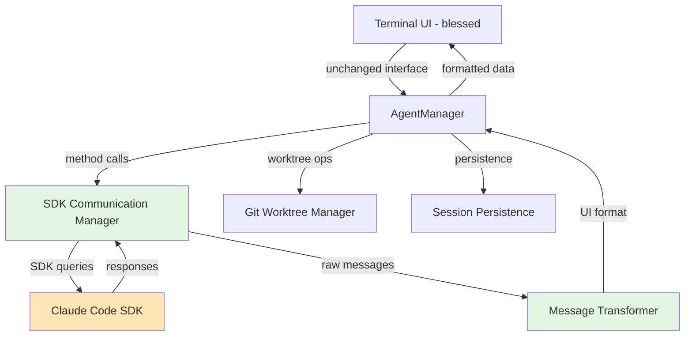

# Component Architecture

## New Components

### SDK Communication Manager
**Responsibility:** Handles all Claude Code SDK interactions, replacing CLI process communication  
**Integration Points:** Direct replacement of process spawning methods in AgentManager

**Key Interfaces:**
- `initializeSDKSession(agentId, workingDirectory)` - Creates new SDK session
- `executeQuery(agentId, prompt, options)` - Sends instructions via SDK
- `handleSDKMessage(agentId, message)` - Processes SDK responses
- `terminateSession(agentId)` - Cleanly ends SDK session

**Dependencies:**
- **Existing Components:** Logger, Config, Error handlers
- **New Components:** None - self-contained within AgentManager

**Technology Stack:** Node.js, @anthropic-ai/claude-code SDK

### Message Transformer
**Responsibility:** Adapts SDK message format to existing log/output format for UI compatibility  
**Integration Points:** Sits between SDK responses and existing UI data flow

**Key Interfaces:**
- `transformSDKMessage(sdkMessage)` - Converts SDK format to UI format
- `extractContent(message)` - Pulls text content from SDK messages
- `mapMessageType(sdkType)` - Maps SDK types to UI log types

**Dependencies:**
- **Existing Components:** UI data structures
- **New Components:** SDK Communication Manager

**Technology Stack:** Pure JavaScript transformation logic

## Component Interaction Diagram

