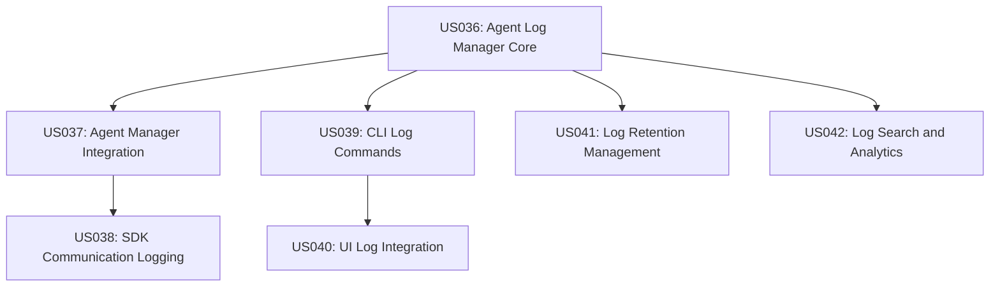

# Persistent Agent Logging Epic Summary

## Overview

This epic implements persistent logging for Napoleon agents with descriptive filenames containing initial prompts, enabling debugging and historical analysis of agent behavior even after termination.

## Epic Goal

Enable developers to debug agent issues by providing complete visibility into agent execution history, raw Claude SDK communication, and searchable logs that persist beyond agent lifecycle.

## User Stories Created

### Phase 1: Core Infrastructure (High Priority)
**Epic Foundation - Must be completed first**

- **US036: Agent Log Manager Core Implementation** (8 pts)
  - Core service for creating persistent log files with descriptive names
  - File stream management and structured logging
  - Foundation for all other logging features

- **US037: Agent Manager Integration** (5 pts) 
  - Integrate logging into agent spawn/termination lifecycle
  - Maintain backwards compatibility with existing systems
  - Dual logging (memory + persistent files)

- **US038: SDK Communication Transparent Logging** (6 pts)
  - Complete visibility into Claude SDK requests/responses
  - Raw API communication capture for debugging
  - Error logging with full context and stack traces

### Phase 2: CLI and UI Integration (Medium Priority)
**User Access and Integration**

- **US039: CLI Log Viewing Commands** (5 pts)
  - Command-line tools for listing, viewing, and searching logs
  - Integration with main Napoleon CLI
  - Support for external editor launching

- **US040: Agent Detail View Log Integration** (4 pts)
  - UI enhancements to show persistent log paths
  - Historical log access for terminated agents
  - External viewer integration and status indicators

### Phase 3: Advanced Features (Low Priority)
**Operational Excellence and Analytics**

- **US041: Log Retention Management System** (6 pts)
  - Automatic cleanup and compression policies
  - Configurable retention rules by age/count/size
  - Background scheduling and safety mechanisms

- **US042: Advanced Log Search and Analytics** (8 pts)
  - Full-text search with indexing across all logs
  - Performance analytics and error pattern detection
  - Agent behavior analysis and reporting

## Implementation Strategy

### Recommended Development Order

1. **Start with US036** - Agent Log Manager Core
   - This is the foundation that all other stories depend on
   - Establishes file naming conventions and structured logging

2. **Follow with US037** - Agent Manager Integration  
   - Connects core logging to agent lifecycle
   - Enables basic persistent logging functionality

3. **Add US038** - SDK Communication Logging
   - Provides debugging transparency for Claude API calls
   - Completes the core logging infrastructure

4. **Implement US039** - CLI Log Commands
   - Provides basic user access to persistent logs
   - Enables developers to start using the logging system

5. **Add US040** - UI Integration
   - Completes the user-facing functionality
   - Provides convenient access within the Napoleon UI

6. **Optional: US041 & US042** - Advanced Features
   - Implement based on actual usage and operational needs
   - Can be deferred until core functionality is proven

## Story Dependencies



## Success Criteria

### Minimum Viable Product (MVP)
- **Core Stories (US036-US038)**: Persistent logging with SDK transparency
- **Basic Access (US039)**: CLI commands for log viewing

### Full Feature Set
- **Complete UI Integration (US040)**: Seamless experience in Napoleon UI
- **Operational Readiness (US041)**: Automated log management
- **Advanced Analytics (US042)**: Comprehensive debugging insights

## Key Benefits Delivered

### For Debugging
- Complete agent execution history preserved
- Raw Claude SDK requests/responses visible
- Timeline reconstruction of agent behavior
- Error analysis with full context

### For Operations  
- Stable log paths supporting `tail -f` workflows
- Prompt-based filenames for easy log discovery
- Configurable retention preventing disk space issues
- External tool monitoring of log directories

### For Development
- Non-intrusive integration preserving existing functionality
- Extensible architecture for future enhancements
- Searchable structured format enabling analysis tools
- Historical data for performance optimization

## Technical Highlights

### File Naming Convention
```
{date}_{agent-id}_{sanitized-prompt}.log
Example: 2024-01-15_agent-123_fix-auth-bug.log
```

### Log Entry Format
```json
{
  "timestamp": "2024-01-15T10:30:45.123Z",
  "agentId": "agent-12345",
  "type": "system|sdk_request|sdk_response|sdk_error|info",
  "source": "napoleon|claude_sdk|user", 
  "content": "Raw message content",
  "metadata": { "event": "...", "duration": 1200 }
}
```

### Configuration Options
- Enable/disable persistent logging
- Retention policies (age, count, size)
- Log compression and archival
- Search indexing preferences

## Effort Estimation

| Phase | Stories | Total Points | Estimated Time |
|-------|---------|--------------|----------------|
| Phase 1 | US036-US038 | 19 pts | 1-2 weeks |
| Phase 2 | US039-US040 | 9 pts | 1 week |
| Phase 3 | US041-US042 | 14 pts | 1-2 weeks |
| **Total** | **7 stories** | **42 pts** | **3-5 weeks** |

## Risk Mitigation

### Technical Risks
- **File System Performance**: Stream-based logging and efficient indexing
- **Disk Space Usage**: Comprehensive retention management (US041)
- **Integration Complexity**: Maintain strict backwards compatibility

### Operational Risks  
- **Log Accumulation**: Automatic cleanup and monitoring
- **Security Concerns**: Appropriate file permissions and PII handling
- **Platform Differences**: Cross-platform testing and compatibility

---

This epic provides a robust foundation for persistent agent logging while maintaining simplicity and extensibility for future enhancements. The phased approach allows for incremental value delivery and risk mitigation.